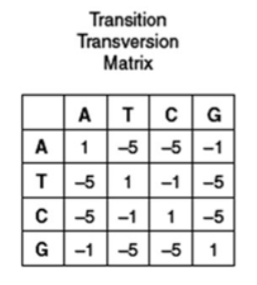

# Introduction
We have taken a tissue sample from a genetically modified mouse and performed RNA
sequencing with the intention of exploring the expression levels. Attached to this assignment is a
BAM file for one of those individual cells (in '.sam' format to be readable). This file contains reads
which have been aligned to the mouse genome.  

A BAM file is the standard data template for all of the genetic information in a library. As such, it is
the starting point for many analyses approaches. We would like you to become familiar with the
contents of a BAM file and their biological implications by investigating the contents of this file.  

Use the tables linked to in the appendix to help you interpret the contents of the file.  

In your answers, please list all relevant code used and results found.


# Data and Requirements
Data for Q1-Q2: single_cell_RNA_seq_bam.sam  
Data for Q3: RNA_seq_annotated_variants.vcf  

# Questions 
## Q1. Sequencing technologies
Why areas of the genome with high GC content are hard to sequence?  


It is important to understand the structural biology of GC regions of DNA. Cytosine and Guanine for three hydrogen bonds, unlike adenine and thymine that form only two. This increase the electrostatic force and pi staking, actively attracting the two molecules together. That being said, when performing biochemical assays such as a polymerase chain reaction, the original strands need to be separated. Rich region will require more energy to "unzip". Furthermore, they will tend to coil up into hairpins and other complex tertiary structures, rendering assays difficult to perform successfully.When thinking about the next generation sequencing workflow, we know that the fragmentation, conversion and adapter ligation steps are not affected by those GC rich regions. The issue comes at the library amplification step, when DNA has to be denatured and cloned - GC rich regions can be underrepresented due to incomplete denaturation or polymerase stalling. Cluster generation on Illumina flow cells can also be affected by the same phenomenon. Even if the clonal expansion of the libraries is performed properly, it is difficult to bind fluorescent probes properly to those GC rich regions due to the DNA secondary structures that prevent proper hybridization or extension during sequencing by synthesis.


Sources: 

Most sequencing techniques are biased against sequencing GC rich regions. This mainly comes down to the fact that the GC pairing involves three hydrogen bonds, while AT pairs only have two. That makes GC rich regions more stable and less likely to break apart, which is necessary for all sequencing methods, and therefore have low to no representation in sequencing output [1].

In DNA pairing, A and T exhibit relatively weaker bonding compared to G and C. Higher GC ratios intensify the stability of DNA strand, raising the likelihood of non-disassociation between strands or nonspecific binding of probes to unintended sites. Additionally, high-GC regions might form secondary structures that can interfere with capture or sequencing. Conversely, extremely low GC ratios weaken probe-target DNA binding, potentially leading to probe detachment [2].


[1] https://www.reddit.com/r/askscience/comments/7l27a7/what_makes_whole_genome_sequencing_so_difficult/ 
[2] https://www.celemics.com/resources/blogs/blog-ngs-hard-to-capture-regions-en/ 


## Q2. Global alignment exercise
Similar to the approach for Needleman–Wunsch algorithm, find the best global alignment
between the two following sequences:  
ATTCGAC  
ATCAC  
Use a gap penalty of -2 and the following scoring matrix:  

   

In your answer, please include the grid table (used for storing the scores and traceback) and also
include how you calculated the first top-left 9 elements of the table.


```{r}
# create the two DNA sequence objects
seq1 <- strsplit("ATTCGAC", split = "")[[1]]
seq2 <- strsplit("ATCAC", split = "")[[1]]

# This function performs the needleman-wunsch alignment on two DNA character strings. It will apply a penality of -2 for a gap, -1 for a base transition (C-T or A-G mutation), -5 for a transversion, and 1 for a match. the first argument is the reference and the second is the segment we try to align. It returns a matrix, representing the scores of different alignments.
needleman_wunsch_storing_matrix <- function(s1, s2) {
  
  # convert the DNA sequence to a numeric vector
  s1 <- ifelse(s1 == "A", 1, ifelse(s1 == "T", 2, ifelse(s1 == "C", 3, ifelse(s1 == "G", 4, -1))))
  s2 <- ifelse(s2 == "A", 1, ifelse(s2 == "T", 2, ifelse(s2 == "C", 3, ifelse(s2 == "G", 4, -1))))
  
  # create a transition transversion matrix
  penalty_matrix <- rbind(c(1,-5,-5,-1),c(-5,1,-1,-5),c(-5,-1,1,-5), c(-1,-5,-5,1))
  
  # create gap penalty
  gap_penalty <- -2
  
  # Needleman-Wunsch algorithm
  # Initiate the matrix
  storing_table <- matrix(0, nrow = (length(s2) + 1), ncol = (length(s1) + 1))
  # fill in with gap penalty on the x-axis
  for (i in 2:ncol(storing_table)){
    storing_table[1,i] <- (-2) * (i-1)
  }
  # fill in with gap penalty on the y-axis
  for (i in 2:nrow(storing_table)){
    storing_table[i,1] <- (-2) * (i-1)
  }
  
  # fill the table
  for (i in 2:nrow(storing_table)){
    for (j in 2:ncol(storing_table)){
      match_score <- storing_table[i - 1, j - 1] + penalty_matrix[s2[i - 1], s1[j - 1]]
      delete_score <- storing_table[i - 1, j] + gap_penalty
      insert_score <- storing_table[i, j - 1] + gap_penalty
      
      storing_table[i, j] <- max(match_score, delete_score, insert_score)
    }
  }
  
  print (storing_table)
}

# call the function on our two DNA strings
seq1_seq2_score_matrix <- needleman_wunsch_storing_matrix(seq1, seq2)


# This function performs traceback on a needleman-wunsch score matrix. It returns a vector containing the instructions to the path of minimal score. The arguments are the two DNA character vectors and the needleman-wunsch score matrix.
needleman_wunsch_traceback_vector <- function(storing_table, s1, s2) {
  
  # initialize the number of steps that it will take to reach the first cell
  i <- nrow(storing_table)
  j <- ncol(storing_table)
  traceback_vector <- c()
  
  # convert the DNA sequence to a numeric vector
  s1 <- ifelse(s1 == "A", 1, ifelse(s1 == "T", 2, ifelse(s1 == "C", 3, ifelse(s1 == "G", 4, -1))))
  s2 <- ifelse(s2 == "A", 1, ifelse(s2 == "T", 2, ifelse(s2 == "C", 3, ifelse(s2 == "G", 4, -1))))
  
  # create a transition transversion matrix
  penalty_matrix <- rbind(c(1,-5,-5,-1),c(-5,1,-1,-5),c(-5,-1,1,-5), c(-1,-5,-5,1))
  
  # create gap penalty
  gap_penalty <- -2
  
  while (i > 1 && j > 1) {
    score <- storing_table[i, j]
    diag_score <- storing_table[i - 1, j - 1] + penalty_matrix[s2[i - 1], s1[j - 1]]
    up_score   <- storing_table[i - 1, j] + gap_penalty
    left_score <- storing_table[i, j - 1] + gap_penalty
  
    # check which direction produced the current score
    if (score == diag_score) {
      traceback_vector <- c(traceback_vector, "diag")
      i <- i - 1
      j <- j - 1
    } else if (score == up_score) {
      traceback_vector <- c(traceback_vector, "up")
      i <- i - 1
    } else if (score == left_score) {
      traceback_vector <- c(traceback_vector, "left")
      j <- j - 1
    }
  }
  
  print(traceback_vector)
}

# call the function on the score matrix found precedently
needleman_wunsch_traceback_vector(seq1_seq2_score_matrix, seq1, seq2)
```
The Needleman–Wunsch algorithm was used to perform the alignment. A scoring matrix was initialized based on the lengths of the two sequences, with the first row and column filled with gap penalties. At each step, the algorithm compared bases to determine matches, mismatches, or gaps, and filled the matrix accordingly. Finally, a traceback process identified the sequence of steps leading to the optimal alignment. The first 9 elements of the table were computed as discussed above. 


## Q3. Looking at the Metadata of an alignment (SAM) file
### Q3.1.
Use `read.csv("single_cell_RNA_seq_bam.sam", nrows=73, sep="\t", header=FALSE,
fill=TRUE)` to load the first 73 lines of the header of the file and print the contents. These lines
contain tabulated information about the BAM file and the circumstances of its data collection.
According to the header table in section 1.3 of the BAM/SAM document in the appendix, what do
the `SN` and `LN` tags indicate?

```{r}
single_cell_RNA_seq_bam <- read.csv("single_cell_RNA_seq_bam.sam", nrows=73, sep="\t", header=FALSE,
fill=TRUE)

head(single_cell_RNA_seq_bam)
```

According to the header table in section 1.3 of the BAM/SAM document in the appendix;
- `LN` means: Reference sequence length. Range: [1, 2^(31) − 1]
- `SN` means: Reference sequence name. The `SN` tags and all individual AN names in all @SQ lines must be
distinct. The value of this field is used in the alignment records in RNAME and RNEXT fields.
Regular expression: `[:rname:∧*=][:rname:]*`

In simple terms, every observation, denoted by @SQ, has a `SN` field that indicates the name of the reference sequence, and a `LN` field that indicates the lenght of that reference sequence in base-pair length.


### Q3.2.
A sequence is any template string of bases to which we can align a read. This includes
chromosomes (which are continuous sequences of bases) and new strings resulting from genetic
modifications. What is the length of the X chromosome, in bp, for our alignment?

```{r}
# Find the Chromosome X, and its associated length
ChrX_len <- single_cell_RNA_seq_bam[single_cell_RNA_seq_bam$V2 == "SN:X", "V3"]
ChrX_len_value <- as.numeric(sub("LN:", "", ChrX_len))
paste("The length of the Chromosome X is", ChrX_len_value, "base pairs.")
```

Fun fact (not tested): One of the sequences in this BAM file titled Cre_ERT2 is a Cre-recombinase
variant. Cre recombinase, when combined with the loxP sequence (see cre-lox recombination) is
the primary element used in many experiments (such as this one) to induce a genetic
modification to certain cells in vivo. This allows us to study the effect of changing a gene at any
time during the life cycle of an organism, and has allowed us to make discoveries in many areas
including stem cell research.

## Q4. Looking at the Reads of an alignment (SAM) file
### Q4.1. 
Use the code below to load the reads into an R dataframe. Each row contains one read.
How many reads are there in this BAM file?

```{r}
sam <- read.csv("single_cell_RNA_seq_bam.sam", sep="\t", header=FALSE,
comment.char="@", col.names = paste0("V",seq_len(30)), fill=TRUE)
sam <- sam[paste0("V",seq_len(11))]

# how many reads are there in this BAM file?
n_reads <- nrow(sam)
paste("There is ", n_reads, "reads in this BAM file.")
```

### Q4.2.
Print out the 10th row of the dataframe to look at the format of a read. Compare it to the
mandatory BAM fields table in section 1.4 of the SAM/BAM documentation in the appendix. **The
order of columns in the bam file have been preserved in the dataframe**. Which column of
your dataframe should you look at to find the chromosome to which the read was aligned? To
which BAM data field does the dataframe column "V11" correspond?

```{r}
# Print the 10th row of the dataframe
sam[10,]
```
   

Comparison of a sample of the BAM file provided against the mandatory fields of BAM files:
- Both contain 11 fields. In other words, the BAM file provided is complete .
- The reference chromosome is stored in the column 3, in the RNAME field that stores the reference sequence name.
- "V11" column stores the quality of the reads, specifically, the ASCII of Phred-scaled base QUALity+33.

### Q4.3. How many reads in this file align to chromosome X?  
```{r}
ChrX_count <- 0
for (i in 1:length(sam$V3)){
  if (sam$V3[i] == "X"){
    ChrX_count <- ChrX_count + 1
  }
}

paste("There is ", ChrX_count, "reads that align to chromosome X.")
```

Hint: You can compare a column vector to a constant using logical symbols (==, <, >, etc.) to get a
column vector of TRUE or FALSE. Remember, when summing, a true symbol is worth "1" while a
false symbol is worth "0".  

### Q4.4. What is the mean base quality (BQ) for reads aligning to chromosome X?   
```{r}
# Extract the subset of the SAM files that is aligned to ChrX
SAM_ChrX <- subset(sam, V3 == "X")

# Load ASCII tools
library(DescTools)

# Convert the ASCII base quality into a numeric value 
overall_quality <- 0
iteration_nu <- 0
for (i in 1:length(SAM_ChrX$V1)){
  vector_quality <- mean(CharToAsc(SAM_ChrX$V11[i]))
  overall_quality <- overall_quality + vector_quality
  iteration_nu <- iteration_nu + 1
}

# Compute mean base quality 
mean_BQ <- round(overall_quality/iteration_nu, 2) - 33
paste("The mean base quality (BQ) for reads aligning to chromosome X is: ", mean_BQ)
```

### Q4.5. Plot the distribution of BQs across all bases and reads as a boxplot. Comment on your observation.  
```{r}
# Add a mean read quality to every read 
SAM_ChrX$mean_quality <- NA 

# Populate the new column with mean read quality 
for (i in 1:length(SAM_ChrX$V1)){ 
  SAM_ChrX$mean_quality[i] <- mean(CharToAsc(SAM_ChrX$V11[i])) - 33
  }

# Plot the boxplot
library(ggplot2)

ggplot(SAM_ChrX, aes(x = mean_quality)) +
  geom_boxplot(fill = "slateblue", alpha = 0.3, outlier.color = "red") +
  ylab("Mean Base Quality per Read") +
  ggtitle("Distribution of Base Quality Scores Across All Reads") +
  theme_minimal()
```

Hint: This is similar to a boxplots that was provided in the lecture related to primary analysis.  

Comment:  
We can see that the three upper quartiles are quite condensed, suggesting a good base quality along those reads. The tight clustering across reads indicates overall consistent sequencing performance. The median value is high, suggesting that most of the reads have good per-base quality. However, we can also observe many, many outliers that have a mediocre base quality. We might want to get rid of those lower quality reads to ensure we only include high quality reads into our analysis.

### Q4.6. Referring to section 1.4 of the SAM/BAM documentation, what column contains the leftmost mapping position of the reads?  

From section 1.4 of the SAM/BAM documentation, the column containing the leftmost mapping position of the reads is Column 4 - POS (1-based leftmost mapping POSition). 

### Q4.7. 
In order to transform a BAM file into expression levels for each gene, we need to count the
number of reads covering a particular location or gene. The protein Hspa8 is located on
chromosome 9 at bases 40801273 - 40805199. How many reads have their leftmost mapping
position aligned within these coordinates?  

```{r}
# Define Chromosomes
start_base <- 40801273
end_base <- 40805199

# Find chromosome 9 & reads within defined chromosomes
Hspa8_reads <- sam[sam$V3 == "9" & sam$V4 >= start_base & sam$V4 <= end_base, ]

# Count number of reads 
num_Hspa8_reads <- nrow(Hspa8_reads)
paste("There are", num_Hspa8_reads, "reads with leftmost mapping position within the Hspa8 region.")
```

Hint: you can implement AND logic on two column vectors with "&".  

### Q4.8. 
Mapping quality is an indication of how well a read aligned to the reference genome during
the alignment step of processing our library data. It is reported as an integer between 0 and 255.
How many reads have mapping quality less than 50?  

```{r}
# Find number of reads with mapping quality less than 50
reads_u50 <- sam[sam$V5 < 50, ]
num_reads_u50 <- nrow(reads_u50)
paste("There are", num_reads_u50, "reads with mapping quality less than 50.")
```


### Q4.9. What is the mean mapping quality of the reads which have mapping quality less than 50?  

Hint: you can obtain a subset of a dataframe by using df[bool_vec,] where bool_vec contains
TRUE/FALSE elements and bool_vec and df have the same number of rows.   

```{r}
# Create logical vector for reads with MAPQ < 50
low_quality_vec <- sam$V5 < 50

# Obtain subset of df
low_quality_subset <- sam[low_quality_vec, ]

# Find the mean
mean_low_quality <- mean(low_quality_subset$V5, na.rm = TRUE)
paste("The mean mapping quality of reads with MAPQ < 50 is", round(mean_low_quality, 2))

# Verify this
table(reads_u50$V5) # makes sense bc most of the reads have 0 confidence
```


### Q4.10. (bonus): 
The genome of the mouse used in this experiment has been edited to include the
DNA sequence for the protein 'tdTomato', which is a fluorophore. Count the number of reads
which align to the tdTomato sequence. Assuming that these reads are accurate, would you expect
this cell to emit fluorescently? What might be the purpose of modifying a genome to include a
fluorophore?   

Hint: Think about studying cell populations under a microscope.  

## Q5. Investigating the Variants  
We have used Strelka, which is a variant-calling tool, to find all of the SNPs and short indels in the
genome of this cell using the BAM file. The variants were then annotated using snpEff to label
them with information such as which gene they affect and the type of modification they result in
once the RNA undergoes translation to a protein. The results are in a VCF file (extension '.vcf')
which is attached.   


### Q5.1. 
Use the following lines of code to obtain the header of the file and a dataframe where each
row is a variant. As you can see, information in the VCF file is organised by multiple levels of
character-separated data, so it will take multiple rounds of parsing to extract relevant
information. For the first variant (row) in the dataframe, what is the reference allele base at the
site, and what is the alternative allele called by Strelka?  

```{r}
vcf_con <- file("RNA_seq_annotated_variants.vcf", open="r")
vcf_file <- readLines(vcf_con)
close(vcf_con)
vcf <- data.frame(vcf_file)
header <- vcf[grepl("##", vcf$vcf_file), ]
factor(header)
variants <- read.csv("RNA_seq_annotated_variants.vcf", skip=length(header),
header=TRUE, sep="\t")

# Extract the first row’s REF and ALT alleles
ref_allele <- variants$REF[1]
alt_allele <- variants$ALT[1]
paste("The reference allele is", ref_allele, "and the alternative allele is", alt_allele)
```


Hint: Take a look at the VCF Variant Call Format document in the appendix for details on each
column name.   


### Q5.2. 
The INFO field is organised into variables by the form 'TAG=value' (see the VCF Variant Call
Format document). Write code to obtain the entirety of the ANN info value contents from the
INFO field for the first variant.  

Hint: You will need strsplit() and grep()/grepl() to accomplish this. Take a look at https://www.math.
ucla.edu/~anderson/rw1001/library/base/html/strsplit.html and https://stackoverflow.com/questi
ons/21311386/using-grep-to-help-subset-a-data-frame-in-r for how to make use of them. With
which character should you split the string?  

Hint: Make sure to convert the INFO field entry to string format using as.character() so that it can
be passed into strsplit().  

```{r}
# Get INFO column for first var
info_field <- as.character(variants$INFO[1])

# Split INFO field into its components
info_split <- strsplit(info_field, ";")[[1]]

#Find the ANN entry
ANN_index <- grep("^ANN=", info_split)
ANN_entry <- info_split[ANN_index]

# Remove ANN=
ANN_value <- sub("^ANN=", "", ANN_entry)
ANN_value
```


### Q5.3. 
Each INFO tag-value pair is detailed in a line of the header, beginning with the tag '##INFO=
<ID=VARIABLE, ...'. Look for the header entry starting with '##INFO=<ID=ANN, ...' which details the
format of the ANN value contents. This tag-value pair contains the results of the annotations
found by snpEff. Based on the ANN value of the first variant, what does the 'Annotation' field tell
us about this variant?  

Hint: snpEff can return multiple annotation entries for the same variant because some variants
may have multiple possible effects. The first annotation entry is the most confident/important
and, resultantly, you should only look at the first entry to answer this and all subsequent
question. You can use strsplit() again with ',' separation character if you wish to look at each of the
ANN entries separately.  

Hint: Refer to the snpEff documentation in the appendix for a list of snpEff annotation label
names and summaries of their effects.  

```{r}
# load VCF (reuse what you had)
vcf_con <- file("RNA_seq_annotated_variants.vcf", open="r")
vcf_file <- readLines(vcf_con)
close(vcf_con)
header_lines <- vcf_file[grepl("^##", vcf_file)]
variants <- read.csv("RNA_seq_annotated_variants.vcf", skip=length(header_lines), header=TRUE, sep="\t", stringsAsFactors=FALSE)

# find the header line that describes ANN
ann_header_line <- header_lines[grepl("^##INFO=<ID=ANN,", header_lines)]
cat("ANN header line (format description):\n", ann_header_line, "\n\n")

# extract ANN field from INFO for first variant
info1 <- as.character(variants$INFO[1])
info_split <- strsplit(info1, ";")[[1]]
ANN_entry <- info_split[grepl("^ANN=", info_split)]
ANN_value <- sub("^ANN=", "", ANN_entry)

# ANN may have multiple comma-separated annotations; take the FIRST (most important)
first_ann <- strsplit(ANN_value, ",")[[1]][1]

# split by '|' according to snpEff ANN spec
ann_fields <- strsplit(first_ann, "\\|")[[1]]

# According to snpEff spec: field order is
# 1: Allele, 2: Annotation, 3: Annotation_Impact, 4: Gene_Name, 5: Gene_ID, ...
# print the Annotation field
annotation_field <- ann_fields[2]
impact_field <- ann_fields[3]
gene_field <- ann_fields[4]

cat("First ANN entry (raw):\n", first_ann, "\n\n")
cat("Parsed fields:\n")
cat(" Annotation:", annotation_field, "\n")
cat(" Impact:", impact_field, "\n")
cat(" Gene name:", gene_field, "\n")

```


### Q5.4. Perform the parsing done in Q5.1-3 again on variant line 683. What gene would this variant affect?

```{r}
# get row 683 (assuming your variants data.frame is 1-based like read.csv)
row_idx <- 683
if (nrow(variants) < row_idx) stop("VCF has fewer than 683 variants")

info683 <- as.character(variants$INFO[row_idx])
info_split683 <- strsplit(info683, ";")[[1]]
ANN_entry683 <- info_split683[grepl("^ANN=", info_split683)]
ANN_value683 <- sub("^ANN=", "", ANN_entry683)
first_ann_683 <- strsplit(ANN_value683, ",")[[1]][1]
ann_fields_683 <- strsplit(first_ann_683, "\\|")[[1]]

cat("First ANN for variant 683 (raw):\n", first_ann_683, "\n\n")
cat("Parsed relevant fields:\n")
cat(" Annotation:", ann_fields_2 <- ann_fields_683[2], "\n")
cat(" Impact:", ann_fields_3 <- ann_fields_683[3], "\n")
cat(" Gene name:", ann_fields_4 <- ann_fields_683[4], "\n")

```


### Q5.5. Within the entire VCF file, how many HIGH impact variants we see in total? 

```{r}
# Function to extract all ANN entries (first annotation only) and parse impact
extract_first_ann <- function(info_str) {
  comps <- strsplit(as.character(info_str), ";")[[1]]
  ann_entry <- comps[grepl("^ANN=", comps)]
  if (length(ann_entry)==0) return(NA)
  ann_value <- sub("^ANN=", "", ann_entry)
  first_ann <- strsplit(ann_value, ",")[[1]][1]
  fields <- strsplit(first_ann, "\\|")[[1]]
  # return a named list (some fields may be missing - handle safely)
  list(
    allele = ifelse(length(fields)>=1, fields[1], NA),
    annotation = ifelse(length(fields)>=2, fields[2], NA),
    impact = ifelse(length(fields)>=3, fields[3], NA),
    gene = ifelse(length(fields)>=4, fields[4], NA)
  )
}

# apply over all variants
anns <- lapply(variants$INFO, extract_first_ann)
ann_df <- do.call(rbind, lapply(anns, function(x) as.data.frame(x, stringsAsFactors=FALSE)))

# count HIGH impact
high_count <- sum(ann_df$impact == "HIGH", na.rm=TRUE)
cat("Number of HIGH-impact variants:", high_count, "\n")

```


### Q5.6. What is a frameshift variant? Does it have a greater or lesser effect on the resultant protein than a missense variant? Why?  

A frameshift variant is an insertion or deletion (indel) that changes the reading frame of the coding sequence because the number of inserted or deleted nucleotides is not a multiple of three. This shifts how codons are read downstream of the variant and generally leads to a run of incorrect amino acids and often an early stop codon (nonsense) — producing a truncated, usually nonfunctional protein.

A frameshift variant typically has a greater effect than a missense variant. A missense changes one codon to a codon for a different amino acid (single amino-acid substitution) — this can be benign, deleterious, or occasionally beneficial. Frameshifts usually disrupt the entire downstream protein sequence and frequently generate premature stop codons, so the effect is commonly more severe.


### Q5.7. 
We can divide variants into two broad categories: intronic/intergenic and exonic. Count the
number of potential intronic variants. What do you notice about the number of intronic variants
(compared to overall number of variants)?  

Hint: Use grepl() on the INFO field to look for tell-tale tags.  

Hint: assume no overlap between exonic and intronic tags within a variant entry.  

```{r}
# We assume "intron" will appear in the ANN 'annotation' field for intronic variants (snpEff uses 'intron_variant')
intronic_bool <- grepl("intron", ann_df$annotation, ignore.case=TRUE)
n_intronic <- sum(intronic_bool, na.rm=TRUE)
n_total_variants <- nrow(variants)

cat("Total variants:", n_total_variants, "\n")
cat("Intronic variants:", n_intronic, "\n")
cat(sprintf("Intronic fraction: %.2f%%\n", 100 * n_intronic / n_total_variants))

```


### Q5.8. List all the genes that have been affected by coding mutations and have high impact. What do you find that is interesting?  

Hint: You can use SNPeff HIGH/MODERATE impact field to help you finding those genes. 

```{r}
# define a function to detect "coding" annotations: these are those that alter coding sequence
# snpEff annotations that are coding: missense_variant, synonymous_variant, frameshift_variant, stop_gained, splice_acceptor_variant, splice_donor_variant, start_lost, etc.
coding_terms <- c("missense_variant", "synonymous_variant", "frameshift_variant", "stop_gained",
                  "splice_acceptor_variant", "splice_donor_variant", "start_lost", "stop_lost",
                  "inframe_insertion", "inframe_deletion", "coding_sequence_variant")

is_coding <- sapply(ann_df$annotation, function(x) any(sapply(coding_terms, function(t) grepl(t, x, ignore.case=TRUE))))
is_high <- ann_df$impact == "HIGH"

genes_high_coding <- unique(ann_df$gene[is_coding & is_high])
genes_high_coding <- genes_high_coding[!is.na(genes_high_coding) & genes_high_coding!=""]

cat("Genes with HIGH-impact coding mutations (unique list):\n")
print(genes_high_coding)
cat(sprintf("Count: %d\n", length(genes_high_coding)))

```


### Q5.9. (bonus):
Using Strelka on our data, we can detect indels, but only to a limited extent. Most
of the reads in our BAM file have read lengths around 60bp long. Why might this have
consequences for the detection of insertions that are longer than 60bp?  

Insertions longer than 60 bp cannot be fully represented within reads of 60 bp, so Strelka, and other short-read variant callers, will fail to detect them because no read can span both the inserted sequence and its flanking regions to provide clear alignment evidence.

### Q5.10. 
Variant Allele Frequency (VAF) is an important metric that helps us to measure how many
DNA molecules in a given sample are carrying a given variant. It also helps to identify potential
false-positive situations caused by incorrect base calls or alignment. VAF is calculated by   

The number of variant alleles /(The number of Variant alleles + The number of Reference alleles)  

In the form of a boxplot, plot the distribution of the VAFs across all the variants. How many
variants have VAF > 5%? How many of those variants (the ones with >5% VAF) are in coding
regions?  

Hint: You will need to parse the genotype encoding field (GT:GQ:GQX:DP:DPF...) to get allele
counts and then get VAF. To understand that column, look at the VCF Variant Call Format
Document (GATK) section 5.  


```{r}
# Q5.10 - Variant Allele Frequency (VAF) Calculation and Analysis

# Display basic statistics about VAF calculation success
cat("=== VAF STATISTICS ===\n")
cat("Total variants:", nrow(variants), "\n")
cat("Variants with valid VAF:", sum(!is.na(VAF_values)), "\n\n")

# Remove NA values for analysis
VAF_clean <- VAF_values[!is.na(VAF_values)]

# Display distribution statistics
cat("VAF Distribution:\n")
cat("Min:", round(min(VAF_clean), 4), "\n")
cat("Q1 (25%):", round(quantile(VAF_clean, 0.25), 4), "\n")
cat("Median:", round(median(VAF_clean), 4), "\n")
cat("Mean:", round(mean(VAF_clean), 4), "\n")
cat("Q3 (75%):", round(quantile(VAF_clean, 0.75), 4), "\n")
cat("Max:", round(max(VAF_clean), 4), "\n\n")

# Create side-by-side histogram and boxplot using base R
par(mfrow=c(1,2))  # Set up 1 row, 2 columns layout

# Histogram showing the frequency distribution of VAF values
hist(VAF_clean, breaks = 30, 
     main = "Histogram of VAF", 
     xlab = "Variant Allele Frequency",
     col = "lightblue",
     xlim = c(0, 1))
# Add reference line at 0.5 (expected VAF for heterozygous variants)
abline(v = 0.5, col = "red", lwd = 2, lty = 2)
# Add label explaining the reference line
text(0.5, max(hist(VAF_clean, plot=FALSE)$counts) * 0.9, 
     "Expected for\nheterozygous (0/1)", pos = 4, col = "red")

# Boxplot showing the distribution and outliers of VAF values
boxplot(VAF_clean,
        main = "Boxplot of VAF",
        ylab = "Variant Allele Frequency",
        col = "coral",
        ylim = c(0, 1))
# Add reference line at 0.5
abline(h = 0.5, col = "red", lwd = 2, lty = 2)

# Reset plotting layout to single plot
par(mfrow=c(1,1))

# Create an enhanced ggplot2 version of the boxplot
library(ggplot2)
vaf_df <- data.frame(VAF = VAF_clean)

ggplot(vaf_df, aes(x = "", y = VAF)) +
  # Create boxplot with coral fill and semi-transparent appearance
  geom_boxplot(fill = "coral", alpha = 0.6, 
               outlier.color = "red", outlier.alpha = 0.5) +
  # Add horizontal reference line at 0.5 (expected VAF for heterozygous)
  geom_hline(yintercept = 0.5, color = "blue", linetype = "dashed", size = 1) +
  # Add annotation explaining the reference line
  annotate("text", x = 1.3, y = 0.5, label = "Expected for\nheterozygous", 
           color = "blue", size = 3.5) +
  # Set axis labels and title
  xlab("") +
  ylab("Variant Allele Frequency (VAF)") +
  ggtitle("Distribution of Variant Allele Frequencies (Single-Cell Data)") +
  theme_minimal() +
  # Remove x-axis text since there's only one category
  theme(axis.text.x = element_blank(),
        axis.ticks.x = element_blank()) +
  # Format y-axis as percentages from 0-100%
  scale_y_continuous(labels = scales::percent_format(), 
                     limits = c(0, 1),
                     breaks = seq(0, 1, 0.25))

# Count how many variants have VAF > 5%
high_VAF_count <- sum(VAF_clean > 0.05, na.rm = TRUE)
cat("\n=== VARIANT COUNTS ===\n")
cat("Number of variants with VAF > 5%:", high_VAF_count, "\n")
cat("Percentage of all variants:", round(100 * high_VAF_count / length(VAF_clean), 1), "%\n\n")

# Extract and display the genotype (GT) distribution from all variants
# This shows how many variants are heterozygous (0/1), homozygous alt (1/1), etc.
gt_dist <- table(sapply(1:nrow(variants), function(i) {
  gt_fields <- strsplit(as.character(variants[i, 10]), ":")[[1]]
  gt_fields[1]  # GT is the first field in the genotype column
}))

cat("Genotype distribution:\n")
print(gt_dist)
cat("\nInterpretation:\n")
cat("- 0/1 (heterozygous): Expected VAF ≈ 50%\n")
cat("- 1/1 (homozygous alt): Expected VAF ≈ 100%\n")
cat("- 0/0 (homozygous ref): Expected VAF ≈ 0%\n\n")

# Count how many high VAF variants are in coding regions
# Uses the is_coding vector created in Q5.8
if (exists("is_coding")) {
  high_vaf_coding <- sum(!is.na(variants$VAF) & 
                         variants$VAF > 0.05 & 
                         is_coding, 
                         na.rm = TRUE)
  cat("High VAF variants (>5%) in coding regions:", high_vaf_coding, "\n")
  cat("Percentage of high VAF that are coding:", 
      round(100 * high_vaf_coding / high_VAF_count, 1), "%\n\n")
}

# Provide biological context for interpreting the VAF distribution
cat("=== BIOLOGICAL INTERPRETATION ===\n")
cat("This is SINGLE-CELL RNA-seq data from one mouse cell.\n")
cat("The VAF distribution centered around 50-70% is EXPECTED because:\n")
cat("1. Most variants are heterozygous (0/1) - one copy has the variant\n")
cat("2. In a diploid cell, heterozygous variants should show ~50% VAF\n")
cat("3. Deviation from 50% is due to:\n")
cat("   - Low sequencing depth causing sampling noise\n")
cat("   - Allelic imbalance in gene expression (one allele more active)\n")
cat("   - Random monoallelic expression in single cells\n")
cat("4. VAFs near 100% likely represent homozygous variants (1/1)\n")
cat("5. VAFs near 0% would be sequencing errors or reference calls\n\n")

cat("This contrasts with bulk tumor sequencing where:\n")
cat("- Low VAF (5-30%) would indicate subclonal variants\n")
cat("- High VAF (>70%) would indicate clonal/germline variants\n")

```
## APPENDIX
SAM/BAM Format Specification Document: https://samtools.github.io/hts-specs/SAMv1.pdf
VCF Variant Call Format Document (GATK): https://gatk.broadinstitute.org/hc/en-us/articles/36003
5531692-VCF-Variant-Call-Format
snpEff Annotations Document: http://snpeff.sourceforge.net/VCFannotationformat_v1.0.pdf

